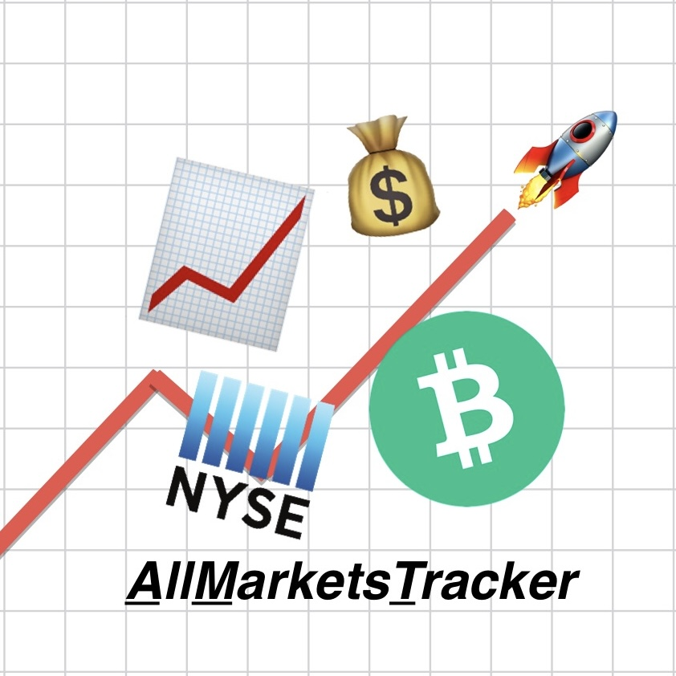
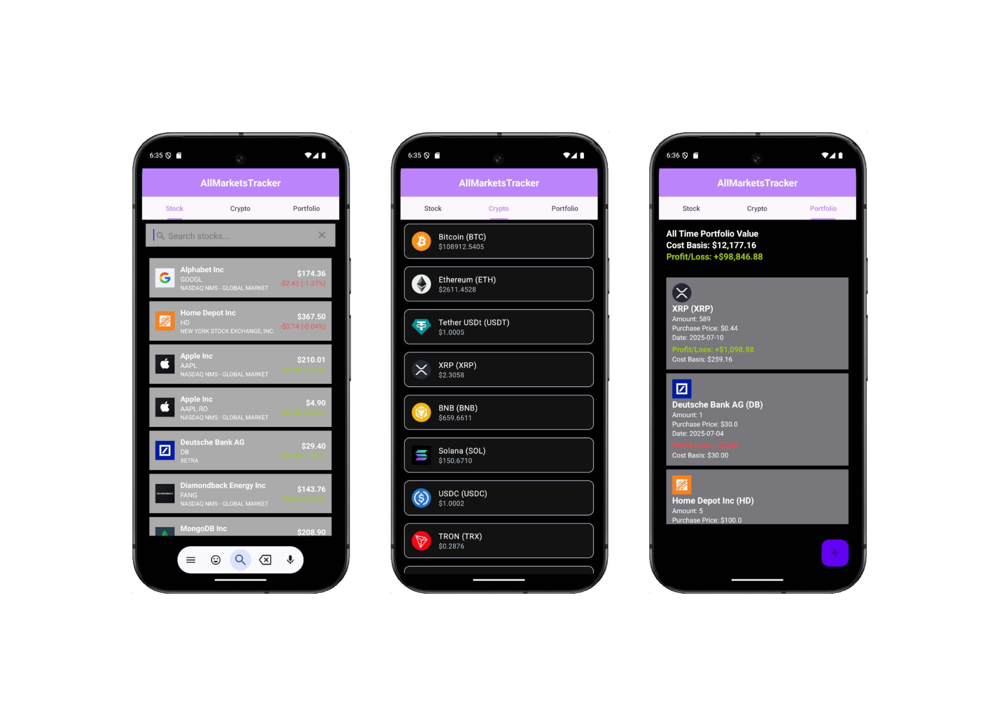

## **AllMarketsTracker**

**Purpose**

AllMarketsTracker is a comprehensive, free stock and crypto portfolio tracker for Android. Unlike many competitors that lock essential features behind a paywall, AllMarketsTracker aims to deliver a premium, user-friendly experience at no cost. The app is currently in its MVP stage, but is designed for ongoing development, with new features and improvements planned for future releases.

---

## **Installation**

Clone the repository using Git in Android Studio.

**Important:** After cloning, be sure to resync using the provided Gradle settings file.

> **📝 Note to grader:**

> API keys for **CoinMarketCap** (crypto data) and **Finnhub** (stock data) are hardcoded in their respective /api directory files for ease of testing.

> The project has been tested by recloning and syncing, and should work out of the box.

---

## **Features**

> **Note:** This is an MVP, but it covers the most essential features for a basic portfolio tracker.

**Multi-Tab, Clean User Interface**

- Seamless navigation between Stocks, Crypto, and Portfolio tabs.
- Modern dark theme for comfortable viewing.

---

**📈 Stock Tab**

- Search and browse stocks using the **Finnhub** API.
- View real-time price, daily performance, and company info.
- Responsive search with instant results.

---

**₿ Crypto Tab**

- Search and browse cryptocurrencies using the **CoinMarketCap** API.
- View real-time price, daily performance, and (for Bitcoin) interactive price charts.
- Hourly, daily, and all-time chart support for Bitcoin (BTC); more assets coming soon.

---

**💼 Portfolio Tab**

- Add and remove both crypto and stock transactions.
- All transactions are stored locally using Room.
- Each transaction displays real-time profit/loss, cost basis, and current value, updated with live API data.
- Long-press to delete transactions with confirmation.

---

## **Tech Stack**

- **Kotlin**: Modern, concise, and safe language for Android development.
- **MVVM Architecture**: Clean separation of concerns using ViewModel, Repository, and Model layers.
- **Room**: Local database for storing portfolio transactions.
- **Retrofit**: Networking library for API calls to CoinMarketCap and Finnhub.
- **Coil**: Efficient image loading for asset logos.
- **Material Design 3**: Modern UI components and dark theme.
- **Directory Structure**:
- api/: Retrofit services and API data models.
- data/: Room database, DAOs, and type converters.
- model/: Data models/entities for Room and UI.
- repository/: Repository classes for data management.
- viewmodel/: All ViewModel classes for UI logic.
- ui/: Fragments, Dialogs, Adapters, and Activities for the user interface.

---

## API Usage & Rate Limits

- **CoinMarketCap API** (crypto data):
Free tier is limited to 30 requests per minute.
- **Finnhub API** (stock data):
Free tier is limited to 60 requests per minute.

### **Rate Limit Handling**

To provide a smooth user experience despite these limits, the app:

- Batches requests where possible.
- Avoids unnecessary repeated calls (e.g., only fetches data when needed).
- Caches recent results in memory for the session.
- Notifies the user if data cannot be loaded due to rate limits.

Despite these efforts, you may occasionally experience delays or missing data if the rate limit is exceeded, especially when searching for many assets in a short period.

---

## **Demo**

<a href="https://youtube.com/shorts/wQKu-SnPoaI?feature=share" target="_blank">📹 Watch 2-Minute Demo</a> 

*Click the link above to view a comprehensive demo of all features outlined above.* 

---

## **Future Development**

Planned premium features and improvements include:

- News articles for stocks and crypto assets.
- Chart support for all assets (not just Bitcoin).
- Enhanced UI/UX, including mini-charts for each transaction in the portfolio.
- Trading account integration for automatic transaction syncing.
- More advanced analytics and reporting.

---

**Roadmap**

**Phase 1:**

- Core MVP: Multi-tab UI, add/remove transactions, live price/profit/loss, Room storage.

**Phase 2:**

- Chart support for all assets.
- News integration.
- UI/UX enhancements (mini-charts, improved dialogs).

**Phase 3:**

- Trading account sync (API integrations for brokerages/exchanges).
- Advanced analytics and reporting.
- Push notifications for price alerts and news.

**Phase 4:**

- Community features, sharing, and more.

---

## **Contact Information**

Thank you for reviewing this project!

For questions, feedback, or collaboration, please reach out:

- **Email:** troyfitzgerald3@gmail.com
- **LinkedIn:** in/troyfitz

---